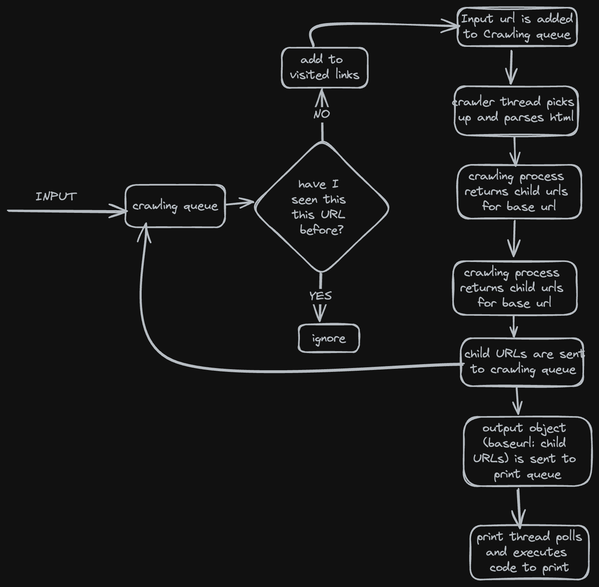

Web-Crawler
===========
This is a simple web-crawler that can be used to crawl a website and find all the links in the website. The web-crawler is implemented in java and uses the JSoup library to parse the HTML content of the website.

Table of Contents
-----------------
- [How to run](#how-to-run)
  * [**Using Docker**:](#using-docker)
  * [**Using java and maven**:](#using-java-and-maven)
- [Components](#components)
- [Flow](#flow)
- [Design](#design)
- [Design Decisions](#design-decisions)
- [Tradeoffs](#tradeoffs)

How to run
----------
### **Docker**:
**Linux** image has been pushed to docker hub already.
1. Create a directory to store logs to a persistent storage. 
   ```shell
   mkdir -p /tmp/web-crawler/logs
   ```
2. Use the following command to run docker container providing URL as an argument. Replace https://crawler-test.com/ with your input.
   ```shell
   docker run -it --rm  -v /tmp/web-crawler/logs:/logs robinadhingra/crawler:latest https://crawler-test.com/
   ```
3. The result of the crawling process will be stored in `result.log` file in the directory of mounted volume of the project - **/tmp/web-crawler/logs**


### **Java and maven**:

**Prerequisite**: Java and Maven(optional if using jar directly) should be installed on the system.
1. Clone the repository.
2. If you decide to run the program directly without building, skip this step else run the following command to build the project
   ```shell
   cd web-crawler
   mvn clean install
   ```
   This creates a jar file in the target folder. `crawler-jar-with-dependencies.jar`
3. If you skipped step2, get executable jar `crawler-jar-with-dependencies.jar`. Run the following command to execute program.
   ```shell
   java -jar ./target/crawler-jar-with-dependencies.jar   "https://<url_placeholder>"
   ```
   Replace `<url_placeholder>` with the website you want to crawl.
4. The result of the crawling process will be stored in `result.log` file in the root directory of the project - **web-crawler/logs**


Components
------
The web-crawler is implemented using the following classes:
1. **Client** : This is the main class that maintains thread pool for crawling and printing jobs. It takes the URL of the website as input and passes it onto the queue manager to add it to the list of links to be crawled.
2. **QueueManager**: This class is responsible for managing the queues of links to be crawled and elements to be printed. It has utility methods to add and remove elements from two existing queues.
3. **Crawler**: This is the class that crawls the website. It polls the queue for links to be crawled. It uses the JSoup library to parse the HTML content of the website and finds all the links in the website. 
4. **Link**: This is a simple class that is used to represent a link in the website. It has a root URL and it's children.
5. **Printer**: This class is responsible for printing the link objects passed to it. It polls the queue for links to be printed and prints the `toString()` implementation of model class.
6. **Result.log**: contains the result of the crawling process.

Flow
------


Design
------


Design Decisions
----------------
1. **Thread Pool**: The client class maintains a thread pool for crawling and printing jobs. This is done to ensure that the crawling and printing jobs are done in parallel and the client class can continue to add more links to the queue while the crawling and printing jobs are being done.
2. **Queues**: The queue manager class maintains two queues, one for links to be crawled and one for links to be printed. This is done to ensure that the client class can continue to add more links to the queue while the crawling and printing jobs are being done. This helps implement separation of concerns and makes the code more modular. 
3. **Data Structure**: Concurrent data structures are being used where multiple threads are accessing same object. 
    - **ConcurrentHashMap** is used to store the visited links. 
   ```java
    Set<String> visitedLinks = Collections.newSetFromMap(new ConcurrentHashMap<>());
    ```
    - **ConcurrentLinkedQueue** are responsible for storing crawling requests and the printing request. Links are added and removed from the queue in a thread-safe manner.
    ```java
    this.crawlQueue =  new ConcurrentLinkedQueue<>();
    this.printQueue = new ConcurrentLinkedQueue<>();
   ```
4. The project uses logging framework to redirect the logs to two separate files. One for the crawling logs and one for the printing logs. This is done to ensure that the printer logs and the crawling logs are separated and can be easily managed.
5. **Scalability**: The application can be easily converted to scalable production-grade service by segregating crawling and printing jobs.  
6. **Fault Tolerance**: The application can be made fault-tolerant by replacing in memory queues by a robust message broker like Kafka or RabbitMQ.
7. **Resilience**: The application can be made resilient by adding a persistent storage to check point the crawling process. This means that if the crawling process is interrupted, the entire process will have to be restarted from the beginning. Ideally, there should be a mechanism to keep a track of visited links in a **_persistent storage/ cache for application to recover and resume from the last checkpoint._**


Tradeoffs
---------
1. The project is built using native java threads and concurrent data structures. This is done to keep the project simple and avoid the overhead of using a framework like Spring. However, this means that the project is not scalable and cannot be used to crawl large websites.
However, in order to make application scalable, event driven would be a suitable approach. 
2. The project is not using any persistent data storage to check point the crawling process. 
3. There's no limit on depth of crawling. This can lead to long-running threads. A depth limit can be added to avoid this.

All these decisions were made to keep the flow simple and to avoid the overhead of using a framework like Spring. However, these decisions can be revisited if the project is to be used in a production environment.